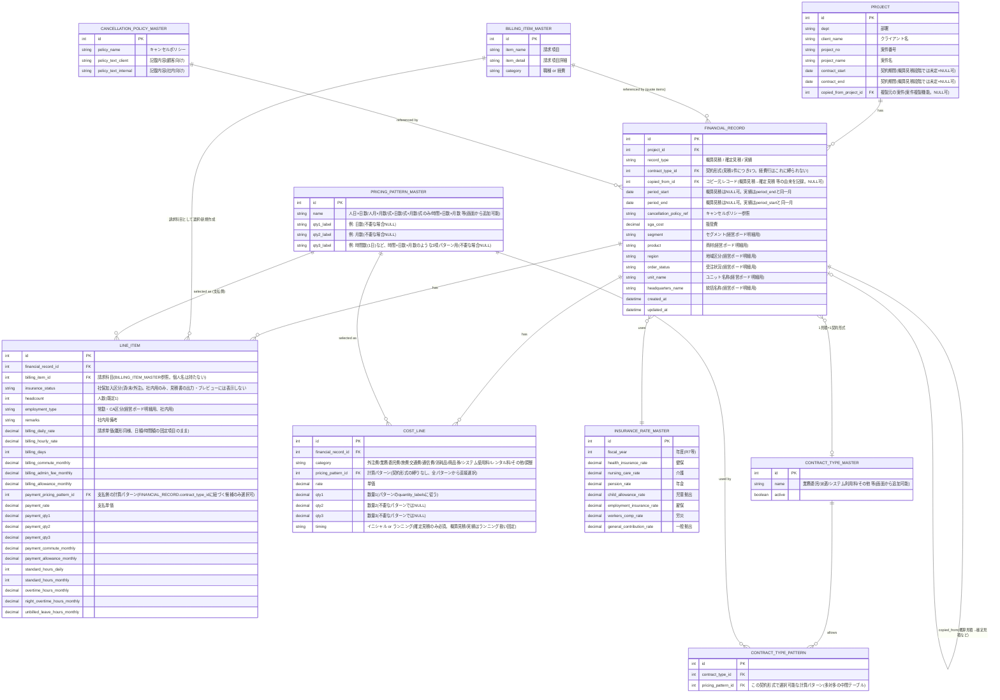
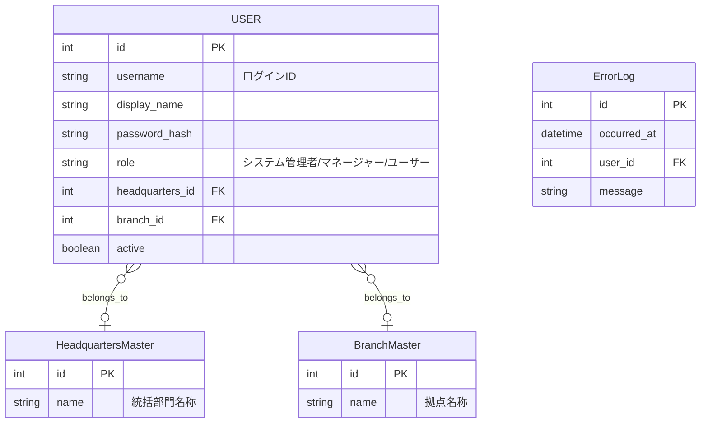

# Architecture: 見積収支計算書ツール

- 作成者: Solution Architect
- 日付: 2026-08-04
- 入力: 10_product_brief.md, 20_project_plan.md,
  references/雛型_見積収支計算書_Ver2.xlsx, 経営ボード明細.xlsx

## STATUS: OK

技術構成・データモデルとも確定した。ADR-4(見積の概算/確定/実績の3段階モデル)は
2026-08-04に人間へ確認し、回答を反映して確定済み。Designer/Developerは着手可能。

## 全体構成

```
[営業/経理] --ブラウザ--> [Streamlit アプリ (Python)]
                              |
                              |-- 案件/見積/実績 CRUD
                              |-- 収支自動計算(法定福利費率マスタ参照)
                              |-- PDF/Excel出力(見積書・収支計算書)
                              |-- 経営ボード明細レコード出力(CSV/Excel)
                              |
                          [SQLite DB (ローカルファイル)]
                              |
                              v
                  経営ボード明細レコード(Excel/CSV)
                              |
                              v
                        [Power BI] (既存の可視化基盤・対象外)
```

## ADR-1: 実行環境 — Python + Streamlit

- **背景**: 依頼者の意向としてPython + Streamlitが挙がっていた。社内ツールで利用者は
  営業・経理の少人数、同時アクセスは多くて数名程度。
- **選択肢**:
  A. Streamlit(依頼者の意向どおり)
  B. Excelマクロ/VBAの改修継続
  C. 本格的なWebフレームワーク(Django/FastAPI+フロントエンド)を新規構築
- **決定**: A(Streamlit)を採用する。
- **理由**:
  - Product Briefの必須要件(複数画面のフォーム入力、自動計算、PDF/Excel出力)は
    Streamlit標準機能+ライブラリ(pandas, openpyxl, reportlab等)で十分実現可能。
  - 少人数利用・社内限定という利用規模に対し、B(Excel継続)は本件の目的(統合・効率化)に
    反し、C(フルスクラッチWeb)は工数に見合わない。
  - Pythonエコシステムはpandas/openpyxlでExcel雛形の数式ロジックを素直に再現しやすく、
    QAでの雛形との検算もしやすい。
- **トレードオフ**: Streamlitは複雑な同時編集や細かい権限制御には不向き。
  ただしProduct Briefで複数ユーザー同時編集・承認ワークフローはWon't(対象外)のため許容する。
  将来的に利用者・データ量が増えた場合は、DB層(ADR-2)を切り出しているため
  Webフレームワークへの移行は可能な設計にする。

## ADR-2: データ保存方式 — SQLite(ファイルベース、SQLAlchemy経由)

- **背景**: 案件・見積/実績レコード・スタッフ明細・各種マスタを永続化する必要がある。
- **選択肢**:
  A. SQLite単一ファイル
  B. 案件ごとにExcelファイルを生成・保存(雛形の延長)
  C. 社内共有DBサーバー(SQL Server等)に新規スキーマを立てる
- **決定**: A(SQLite、ただしSQLAlchemy ORM経由でアクセスし、DB切り替えを容易にしておく)。
- **理由**:
  - 追加インフラ・追加費用が不要(Escalation対象の「新規有償サービス」に該当しない)。
  - 案件横断の検索・一覧・再編集(Must要件)はリレーショナルDBの方がExcel個別ファイルより
    圧倒的に容易。
  - SQLAlchemyでORM化しておけば、将来アクセスが増えた際に社内DBサーバーへの移行が
    モデル変更なしで可能。
- **運用**: DBファイルは社内共有ドライブ上に配置し、日次バックアップ(既存のファイル
  サーバーバックアップ運用に相乗り)。同時書き込みはSQLiteのWALモードで許容範囲。

## データモデル



### 契約形式・計算パターンの汎用計算式

LINE_ITEM(請求側/支払側それぞれ)・COST_LINEとも、金額は次の汎用式で算出する
(未使用の数量スロットは1として扱う)。

```
金額 = 単価(rate) × 数量1(qty1) × 数量2(qty2) × 数量3(qty3)
```

- 契約形式マスタ(初期データ、画面から追加・編集可能):
  - 業務委託 → 計算パターン: 人日×日数 / 人月×月数 / 式×日数 / 式×月数
  - 派遣 → 計算パターン: 時間×日数×月数(`単価`=時給、`qty1`=1日の時間数、
    `qty2`=日数、`qty3`=月数)
  - システム利用料 → 計算パターン: 式×月数 / 式のみ
  - その他 → 計算パターン: 式×日数 / 式×月数 / 式のみ
- COST_LINEは契約形式を経由せず、PRICING_PATTERN_MASTERの全パターンから直接選択する。
- 上記は初期シードデータであり、CONTRACT_TYPE_MASTER・PRICING_PATTERN_MASTER・
  CONTRACT_TYPE_PATTERN(紐付け)はMustとして画面から追加・編集できる
  (05_マスタ管理画面、Product Brief改訂によりMust化)。
- **契約形式は見積(FINANCIAL_RECORD)単位で1つだけ選択する**(2026-08-04 人間確認により決定)。
  見積入力画面では、まず契約形式を選ぶまで明細入力に進めない(Step1: 契約形式選択 →
  Step2: 明細入力、というウィザード的な流れとする)。選んだ契約形式に紐づく計算パターンだけが
  各LINE_ITEMの支払側パターン選択肢に表示される。COST_LINEは前述のとおり契約形式に縛られない。
- **概算見積→確定見積のコピー作成(Must)**: 概算見積レコードの内容(明細行・経費行含む)を
  複製して新しい確定見積レコードを作成できる。元の概算見積レコードは上書きせず保持する
  (`FINANCIAL_RECORD.copied_from_id`にコピー元を記録)。確定見積→実績のコピーはShould。
- **案件作成フロー(Must)**: 案件一覧の「新規案件登録」は、PROJECT基本情報の入力
  (部署/クライアント名/案件名等)→契約形式選択(Step1)→見積明細入力(Step2)までを
  一連のウィザードとする。既存PROJECTに見積(概算/確定)を追加する場合も、
  Step1・Step2は同じ画面フローを再利用する。
- **案件複製(Must)**: PROJECT単位で、配下のFINANCIAL_RECORD・LINE_ITEM・COST_LINEを
  すべて含めて複製し、新しいPROJECTとして保存できる(`PROJECT`に複製元を記録する
  `copied_from_project_id`を追加)。類似案件を1から入力し直す手間を減らす目的。

### 計算ロジック(LINE_ITEM/COST_LINE → FINANCIAL_RECORD集計)

雛形の数式の考え方(請求側・支払側を分けて社保料等を加味する)を踏襲しつつ、
単価×数量の部分は上記の汎用式に置き換える。

1. LINE_ITEM行ごとに(請求側は雛形同様の固定項目、支払側のみ契約形式・計算パターンの汎用式):
   - `売上 = (請求日額単価×日数 + 請求通勤費 + 請求管理費 + 請求手当) × 人数(headcount)`
   - `原価(人件費) = 支払側の金額(汎用式) × 人数(headcount) + 残業/深夜残業割増 + 未請求有休相当`
     (残業・深夜残業・未請求有休は雛形同様、時給換算相当額を別途加算する)
   - `原価(通勤費/手当) = 支払通勤費 + 支払手当`
   - `事業主負担社保料 = 原価(人件費+通勤費+手当) × Σ(INSURANCE_RATE_MASTERの各料率)`
     (該当FINANCIAL_RECORDの`period_start`(実績・確定見積とも計算基準月とする)から
     会計年度を判定し、対応するINSURANCE_RATE_MASTERの行を参照する)
   - `原価総計 = 人件費原価 + 通勤費 + 手当 + 事業主負担社保料`
   - `粗利益 = 売上 - 原価総計`、`粗利率 = 粗利益 / 売上`
2. COST_LINE行ごとに: `金額 = 汎用式(単価×数量1×数量2×数量3)`
3. FINANCIAL_RECORD側で:
   - `人件費(サマリ) = Σ LINE_ITEM.売上`
   - `経費計(COST_LINE) = Σ COST_LINE.金額`(外注費・業務委託費・旅費交通費・通信費・
      消耗品・商品券・システム使用料・レンタル料・その他・調整の合計)
   - `売上高 = 人件費(サマリ) + 経費計(COST_LINE)`
   - `売上原価 = Σ LINE_ITEM.原価総計 + (COST_LINEのうち原価計上区分の項目)`
   - `粗利 = 売上高 - 売上原価`、`粗利率 = 粗利/売上高`
   - `営業利益 = 粗利 - 販管費`

雛形との数値一致は、Developer実装時に`references/雛型_見積収支計算書_Ver2.xlsx`の
実データ行(バックスグループの案件例、業務委託=人日×日数パターンに相当)を使って検算し、
QAで再確認する。

## 経営ボード明細スキーマへのマッピング

対象は「確定見積」「実績」のみ(概算見積は対象外、ADR-4参照)。確定見積は
`period_start`〜`period_end`の各月に1行ずつ展開して出力する
(イニシャル費目=`period_start`の月のみ、ランニング費目=展開後の全月に同額計上)。

| 経営ボード明細 列 | ソース |
|---|---|
| 会社 | 固定値マスタ(設定画面で1社分を保持。将来複数社対応の余地は残すが初期は固定) |
| 区分 | FINANCIAL_RECORD.record_type(確定見積→予算、実績→実績に変換) |
| 常勤・CA | LINE_ITEMを FINANCIAL_RECORD単位に集約する際、代表的な雇用形態を集計 (Must外郭仕様、詳細はDeveloper実装時に運用ヒアリング) |
| 年月 | 月次展開後の対象月(確定見積は`period_start`〜`period_end`の各月、実績は`period_start`) |
| 統括名称 / 部門名称 | 統括名称=FINANCIAL_RECORD.headquarters_name(新設)、部門名称=PROJECT.dept |
| 取引先名称 | PROJECT.client_name |
| 地域区分 | FINANCIAL_RECORD.region(新設) |
| セグメント | FINANCIAL_RECORD.segment(新設) |
| 商材 | FINANCIAL_RECORD.product(新設) |
| 売上高/売上原価/粗利 | 月次展開後、その月に計上される費目(イニシャル/ランニングの区別を反映)から再集計した値 |
| 常勤数/ポジ数 | LINE_ITEM.headcountの合計(雇用形態別) |
| 販売管理費 | FINANCIAL_RECORD.sga_cost(確定見積・実績とも月按分せず、当該月にそのまま計上) |
| 受注状況 | FINANCIAL_RECORD.order_status(新設) |
| ユニット名称 | FINANCIAL_RECORD.unit_name(新設) |
| QT | 展開後の対象月から自動算出(4月始まりの期であれば1〜3月=4QT等、会計年度の期首月をマスタ化) |

雛形の収支計算書には「統括名称/地域区分/セグメント/商材/受注状況/ユニット名称/常勤・CA」に
相当する項目がないため、見積・実績レコード作成画面に新規入力項目として追加する
(Designerへの申し送り事項)。

## ADR-5: 権限ロール・組織属性・論理削除(2026-08-05追加)

- **背景**: 削除操作の権限を役職によって分けたい(システム管理者/マネージャー/ユーザー)。
  削除は取り消せる必要があり、システム管理者はアプリのエラーログも確認したい。
  さらにユーザーごとに統括部門・拠点(組織属性)を割り当てたい。
- **認証方式**: Streamlit Community Cloud自体には社内ユーザー向けの認証基盤がないため、
  アプリ内にID/パスワードのログイン機構を実装する(`app/auth.py`)。パスワードは
  簡易ハッシュ化(sha256+salt)で保存する軽量実装とし、社外公開や高いセキュリティ要件が
  発生した場合はSSO(Microsoft Entra ID等)への切替を別途検討する(既知の制約)。
- **ロールと権限**:

  | ロール | 削除 | 復旧 | エラーログ閲覧 |
  |---|---|---|---|
  | システム管理者 | ○ | ○ | ○ |
  | マネージャー | ○ | × | × |
  | ユーザー | × | × | × |

- **論理削除**: PROJECT・FINANCIAL_RECORDに`deleted_at`(NULL可)を追加。削除は
  `deleted_at`に日時をセットするのみ(物理削除しない)。一覧画面は`deleted_at IS NULL`の
  行のみ表示し、システム管理者には削除済み一覧(ゴミ箱)と復旧操作を提供する。
- **組織属性**: 統括部門名称マスタ(`HeadquartersMaster`)・拠点名称マスタ
  (`BranchMaster`)を新設し、`User`に`headquarters_id`・`branch_id`を持たせる。
  既存のFINANCIAL_RECORD.headquarters_name(経営ボード明細用の自由入力)とは別物として扱う
  (将来的にはユーザーの所属部門をFINANCIAL_RECORD入力時のデフォルト値として使う拡張が可能)。
- **エラーログ**: `ErrorLog`(発生日時・ユーザー・メッセージ)を新設し、各画面のトップレベルで
  例外を捕捉して記録する簡易実装とする。外部ログ基盤(Sentry等)の導入は将来検討。



PROJECT・FINANCIAL_RECORDには`deleted_at: datetime | None`を追加する(上記の論理削除)。

## ADR-6: 印鑑・承認フロー・週次実績(2026-08-06追加)

- **背景**: 確定見積の見積書発行に、本人の個人印鑑→マネージャー承認→社判配置という
  承認フローを設けたい。また実績入力は、見積の明細行編集とは別に「収支管理」メニューで
  確定見積を選び、週単位で入力したい。
- **印鑑画像**: PIL等でラスタ画像を生成する方式は、日本語を描画するためのCJKフォント
  ファイルをリポジトリに同梱する必要があり(Streamlit Cloud上のLinux環境に日本語フォントが
  標準で入っている保証がない)、対応コストが高い。代わりに**SVG文字列**を生成し
  (`app/seal.py`)、ブラウザ側のフォントでテキストを描画させる方式にした
  (画面表示は`st.markdown(..., unsafe_allow_html=True)`で``タグとして埋め込む)。
  `User.seal_svg`(個人印鑑)・`CompanySeal.svg`(社判、最新1件を有効とする)に保存する。
- **承認フロー**: `FINANCIAL_RECORD`に`approval_status`(下書き/申請中/承認済み/却下)・
  `requested_by_id`・`requested_at`・`approved_by_id`・`approved_at`・`reject_reason`を追加。
  対象は確定見積のみ。本人が個人印鑑を生成済みであることを申請の条件とする
  (`pages/02_見積入力.py`、`st.dialog`によるポップアップ確認)。マネージャー・
  システム管理者向けの`pages/09_承認.py`で申請一覧を確認し、承認/却下できる。承認時は
  `Notification`を発行し、申請者がHome画面で確認できるようにする。社判自体は承認時に
  DBへ書き込むのではなく、PDF生成時(未実装、ADR-3参照)に承認済みレコードへ社判画像を
  合成する方針とする。
- **週次実績**: `WeeklyActual`(financial_record_id, week_start, sales, cost, sga_cost,
  headcount_regular, headcount_position, entered_by_id)を新設。確定見積(FINANCIAL_RECORD)
  に対して複数の週次実績を持てる。経営ボード明細出力時は、週の月曜日が属する月へ合算する
  (月をまたぐ週の厳密な日割りは行わない、簡易実装)。これに伴い、`FINANCIAL_RECORD.record_type`
  から「実績」を廃止し「概算見積」「確定見積」の2種類のみとした(ADR-4の3段階モデルを修正)。

## ADR-7(Escalation): SharePoint/Power BI連携(2026-08-06追加、未実施・要人間判断)

- **背景**: Power BIはSharePoint/OneDrive上の経営ボード明細.xlsxを直接参照している。
  ツールからそこへ自動反映するには、Microsoft Graph API(Excel API)でSharePoint上の
  ファイルを直接更新する実装が必要。これには**Azure ADアプリ登録・クライアントシークレット
  等の新規クレデンシャル発行**が要る(Solution Architectのエスカレーション対象)。
- **暫定対応(実装済み)**: `pages/11_経営ボード明細出力.py`でExcel/CSVを出力し、
  人間が既存のSharePointファイルへ手動でコピー&ペーストする運用とする。
- **今後の選択肢**(人間の判断が必要、いずれも本セッションでは着手しない):
  1. Microsoft Graph APIでの自動書き込み(IT部門でのAzure ADアプリ登録が前提)
  2. 既存のPower Automateフロー(README記載の既存基盤)を経由した半自動反映
     (例: ツールが出力したファイルを所定のSharePointフォルダに置くと、Power Automateが
     経営ボード明細.xlsxへの反映を行う)
  3. 当面は暫定対応(手動コピー)を継続する

## ADR-3: 出力方式(PDF/Excel/経営ボード明細レコード)(2026-08-06改訂)

- **見積書PDF/Excel**: 実際のデプロイ先がStreamlit Community Cloud(Linuxコンテナ、
  Excel/LibreOfficeが存在しない)であることが判明したため、当初想定していた
  「openpyxlでテンプレートに流し込み→Excel COM/LibreOfficeでPDF変換」は採用できない
  (既知の制約の是正)。PDFは`reportlab`(純Pythonライブラリ、外部バイナリ不要)で
  直接描画して生成する方式に変更する。Excel出力は引き続きopenpyxlで問題なく生成できる。
  承認済みの確定見積は、生成するPDFに個人印鑑・社判の画像を合成する(ADR-6参照)。
  **2026-08-06時点でPDF生成そのものは未実装**(承認フロー・印鑑データの土台のみ実装済み、
  50_implementation.md参照)。
- **収支計算書PDF/Excel**: 同様にreportlab/openpyxlで生成する(未実装)。
- **経営ボード明細レコード出力**: `pages/11_経営ボード明細出力.py`で実装済み。対象案件を
  選択し、確定見積(区分=予算、期間内の各月に展開)と週次実績(区分=実績、月次に合算)を
  経営ボード明細と同一列構成でExcel/CSV書き出しできる。SharePoint上の既存ファイルへの
  自動反映はADR-7(Escalation)参照、当面は人間による手動マージとする。

## ADR-4: 「年月」の扱い、および見積の3段階(概算/確定/実績)モデル(2026-08-04 人間確認により確定)

- **背景**: 経営ボード明細は1行=1ヶ月分のデータ。一方、人間からの確認回答により、
  以下の実態が判明した。
  1. 見積には「概算見積」段階があり、この段階では期間(契約期間)自体が
     定まっていないケースがある。
  2. 「確定見積」段階では契約期間が定まるが、費目によって
     **イニシャル(初期に1回だけ発生する費用)**と**ランニング(契約期間中、毎月発生する費用)**
     が混在する。
  3. 実績は週次変動を含めて月単位で集計・入力する運用(＝実績は常に「対象月」単位)。
- **決定**: `FINANCIAL_RECORD`を3種類の`record_type`で区別し、期間・費目の持ち方を変える。

  | record_type | 期間の持ち方 | 費目の粒度 | 経営ボード明細への反映 |
  |---|---|---|---|
  | 概算見積 | `period_start`/`period_end`ともにNULL可(期間未定でも登録できる) | 費目合計のみ(イニシャル/ランニング区別不要) | 反映しない(期間が定まらないため月次展開できない) |
  | 確定見積 | `period_start`〜`period_end`(複数月にまたがってよい) | `COST_LINE`テーブルで費目ごとに`timing`(イニシャル/ランニング)を持つ | 期間内の各月に1行ずつ生成。イニシャル費目は`period_start`の月のみに計上、ランニング費目は期間内の全月に入力額をそのまま計上(月割りしない) |
  | 実績 | `period_start = period_end`(単月固定) | `COST_LINE`不要、実額をそのまま集計 | その月1行をそのまま出力 |

- **理由**: 概算見積の段階で無理に期間を仮置きすると、後で確定見積に更新した際に
  ズレたまま残るリスクがある。イニシャル/ランニングを費目単位のフラグにすることで、
  「初期費用は初月のみ、運用費は毎月」という依頼者の説明を素直にモデル化できる。
  月割り計算(日割り等)は行わず、入力されたランニング額をそのまま各月に計上する
  シンプルな方式とし、精緻な按分が必要になった場合はShouldとして別途拡張する。
- **DeveloperへのMustスコープ上の注意**: 経営ボード明細レコード出力(Must)の対象は
  「確定見積」と「実績」のみ。概算見積は出力対象外である旨を画面上にも明示すること。

## ディレクトリ構成(想定)

```
見積収支ツール/
├── app/
│   ├── main.py                # Streamlitエントリポイント
│   ├── pages/
│   │   ├── 01_案件一覧.py
│   │   ├── 02_見積入力.py
│   │   ├── 03_実績入力.py
│   │   ├── 04_収支サマリ.py
│   │   ├── 05_マスタ管理.py
│   │   └── 06_経営ボード明細出力.py
│   ├── models/                # SQLAlchemyモデル(データモデルに対応)
│   ├── services/               # 計算ロジック・出力ロジック
│   └── templates/              # 見積書/収支計算書Excelテンプレート
├── data/
│   └── app.db                  # SQLite(社内共有ドライブに配置)
└── tests/
```

## エラーハンドリング方針

- 入力値検証(単価・日数等の負数禁止、必須項目未入力)はフォーム送信時にStreamlit上で
  即時エラー表示し、DB保存前に弾く。
- 法定福利費率マスタに該当年度のレコードがない場合は、計算せずエラー表示し
  (デフォルト値での計算は誤りを助長するため行わない)、マスタ登録を促す。
- Excel/PDF出力失敗時(テンプレート不整合等)はエラー内容を画面表示し、DB上のデータは
  保持したまま再出力できるようにする。

## Escalation

- 新規有償サービス・クレデンシャルの追加なし(Streamlit/SQLite/openpyxl等はOSS)。
- 既存アーキテクチャの置き換えはなし(雛形Excel運用からの新規構築であり「置き換え」ではなく
  「統合」)。

## 次のアクション

- 本書をDesigner(40_design_brief.md)へ引き継ぐ。
